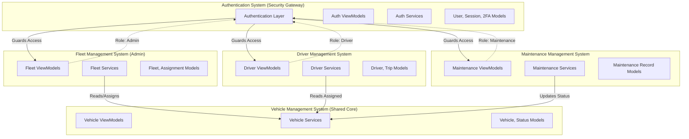

# Fleet Management System - iOS Application Architecture

**Platform:** iOS 15.0+  
**UI Framework:** SwiftUI  
**Architecture Pattern:** Modular MVVM + Service-Oriented Architecture  
**Language:** Swift 5.9+

---

## Executive Summary

This document defines the complete system architecture for a professional-grade Fleet Management System iOS application. The system is designed using a modular, layered approach that ensures separation of concerns, scalability, and maintainability. The architecture comprises five core subsystems, each with clearly defined responsibilities, models, services, and ViewModels, all adhering to the MVVM pattern and SwiftUI best practices.

---

## 1. Global Layered Architecture

All subsystems follow a consistent four-layer architecture:

```
┌─────────────────────────────────────────────────────────────┐
│                        VIEW LAYER                            │
│  (SwiftUI Views, UI Components, Navigation)                  │
└─────────────────────────────────────────────────────────────┘
                            ↕
┌─────────────────────────────────────────────────────────────┐
│                      VIEWMODEL LAYER                         │
│  (@Published properties, User actions, State management)     │
└─────────────────────────────────────────────────────────────┘
                            ↕
┌─────────────────────────────────────────────────────────────┐
│                       SERVICE LAYER                          │
│  (Business logic, Mock APIs, Data transformation)            │
└─────────────────────────────────────────────────────────────┘
                            ↕
┌─────────────────────────────────────────────────────────────┐
│                        MODEL LAYER                           │
│  (Codable entities, Domain models, Enums)                    │
└─────────────────────────────────────────────────────────────┘
```

### Layer Responsibilities

| Layer | Responsibility | Key Characteristics |
|-------|---------------|---------------------|
| **View** | UI presentation, user interaction | SwiftUI views, navigation, bindings |
| **ViewModel** | State management, view logic | `ObservableObject`, `@Published`, input/output handling |
| **Service** | Business logic, data operations | Protocol-based, mockable, async operations |
| **Model** | Data structures, domain entities | `Codable`, `Equatable`, `Identifiable` |

---

## 2. System Architecture Diagram



---

## 3. Authentication System (Security Gateway)

### Purpose
The Authentication System serves as the security gateway for the entire application. It manages user identity, session lifecycle, two-factor authentication, and role-based access control. All other subsystems depend on this system to verify user identity and permissions.

### Core Responsibilities
- User authentication (login, logout)
- Two-factor authentication (2FA) enforcement
- Session management and persistence
- Password recovery and reset
- Admin account setup via email token
- Role-based access control (RBAC)

### Models

| Model | Properties | Purpose |
|-------|-----------|---------|
| **User** | `id: UUID`<br>`email: String`<br>`role: UserRole`<br>`firstName: String`<br>`lastName: String`<br>`isActive: Bool`<br>`createdAt: Date` | Represents an authenticated user |
| **UserRole** | `enum { admin, driver, maintenance }` | Defines user access level |
| **Session** | `id: UUID`<br>`userId: UUID`<br>`token: String`<br>`expiresAt: Date`<br>`isActive: Bool` | Represents an active user session |
| **TwoFactorCode** | `code: String`<br>`userId: UUID`<br>`expiresAt: Date`<br>`isUsed: Bool` | Temporary 2FA verification code |
| **SetupToken** | `token: String`<br>`email: String`<br>`expiresAt: Date`<br>`isUsed: Bool` | One-time admin setup token |
| **PasswordResetToken** | `token: String`<br>`userId: UUID`<br>`expiresAt: Date`<br>`isUsed: Bool` | Password recovery token |

### Services

| Service | Methods | Responsibility |
|---------|---------|----------------|
| **AuthService** | `login(email:password:) async throws -> User`<br>`logout() async throws`<br>`validateSession() async throws -> Bool` | Core authentication operations |
| **TwoFactorService** | `sendCode(userId:) async throws`<br>`verifyCode(userId:code:) async throws -> Bool` | 2FA code generation and validation |
| **SessionManager** | `createSession(user:) -> Session`<br>`getActiveSession() -> Session?`<br>`invalidateSession()` | Session lifecycle management |
| **EmailService** | `sendSetupEmail(to:token:) async throws`<br>`sendPasswordResetEmail(to:token:) async throws` | Email notifications (mocked) |
| **AdminSetupService** | `createAdminAccount(email:) async throws -> SetupToken`<br>`validateSetupToken(token:) async throws -> Bool`<br>`completeSetup(token:password:) async throws` | Admin onboarding workflow |

### ViewModels

| ViewModel | Published Properties | Responsibility |
|-----------|---------------------|----------------|
| **AuthViewModel** | `@Published var isAuthenticated: Bool`<br>`@Published var currentUser: User?`<br>`@Published var errorMessage: String?`<br>`@Published var isLoading: Bool` | Login/logout flow orchestration |
| **TwoFactorViewModel** | `@Published var code: String`<br>`@Published var isVerifying: Bool`<br>`@Published var errorMessage: String?` | 2FA verification UI state |
| **AdminSetupViewModel** | `@Published var setupToken: String`<br>`@Published var password: String`<br>`@Published var confirmPassword: String`<br>`@Published var isSettingUp: Bool` | Admin account setup flow |
| **PasswordRecoveryViewModel** | `@Published var email: String`<br>`@Published var resetToken: String`<br>`@Published var newPassword: String`<br>`@Published var isRecovering: Bool` | Password reset workflow |

### Authentication Workflow

```
┌──────────┐      ┌──────────┐      ┌──────────┐      ┌──────────┐
│  Login   │─────▶│   2FA    │─────▶│ Session  │─────▶│   App    │
│  Screen  │      │ Verify   │      │ Created  │      │  Home    │
└──────────┘      └──────────┘      └──────────┘      └──────────┘
     │                  │                  │                  │
     │ Email/Password   │ 6-Digit Code     │ Token Stored     │ Role-Based
     │ Validation       │ Validation       │ in Keychain      │ Navigation
```

### Role-Based Access Control

```swift
// Pseudo-implementation
enum UserRole: String, Codable {
    case admin
    case driver
    case maintenance
    
    var permissions: [Permission] {
        switch self {
        case .admin:
            return [.viewFleet, .assignVehicles, .manageDrivers, .viewReports]
        case .driver:
            return [.viewAssignedVehicle, .startTrip, .endTrip]
        case .maintenance:
            return [.viewVehicles, .scheduleService, .logMaintenance]
        }
    }
}
```

---

## 4. Fleet Management System (Admin System)

### Purpose
The Fleet Management System is the administrative control center. It provides fleet managers with comprehensive oversight of all vehicles, drivers, assignments, and operational metrics. This system is **admin-only** and enforces role-based access at the ViewModel layer.

### Core Responsibilities
- Fleet-wide vehicle overview
- Driver-to-vehicle assignment management
- Operational reporting and analytics
- Fleet utilization tracking
- Administrative dashboard

### Models

| Model | Properties | Purpose |
|-------|-----------|---------|
| **Fleet** | `id: UUID`<br>`name: String`<br>`vehicleIds: [UUID]`<br>`totalVehicles: Int`<br>`activeVehicles: Int`<br>`createdAt: Date` | Represents a logical fleet grouping |
| **Assignment** | `id: UUID`<br>`driverId: UUID`<br>`vehicleId: UUID`<br>`startDate: Date`<br>`endDate: Date?`<br>`status: AssignmentStatus` | Driver-vehicle assignment record |
| **AssignmentStatus** | `enum { active, completed, cancelled }` | Assignment lifecycle state |
| **FleetReport** | `id: UUID`<br>`reportType: ReportType`<br>`dateRange: DateInterval`<br>`metrics: [String: Any]`<br>`generatedAt: Date` | Analytical report data |
| **ReportType** | `enum { utilization, maintenance, trips, costs }` | Report category |

### Services

| Service | Methods | Responsibility |
|---------|---------|----------------|
| **FleetService** | `getAllFleets() async throws -> [Fleet]`<br>`getFleetById(id:) async throws -> Fleet`<br>`getFleetMetrics(id:) async throws -> FleetMetrics` | Fleet data operations |
| **AssignmentService** | `createAssignment(driverId:vehicleId:) async throws -> Assignment`<br>`getActiveAssignments() async throws -> [Assignment]`<br>`endAssignment(id:) async throws` | Assignment CRUD operations |
| **ReportService** | `generateReport(type:dateRange:) async throws -> FleetReport`<br>`getReportHistory() async throws -> [FleetReport]` | Report generation (mocked analytics) |

### ViewModels

| ViewModel | Published Properties | Responsibility |
|-----------|---------------------|----------------|
| **AdminDashboardViewModel** | `@Published var fleets: [Fleet]`<br>`@Published var activeAssignments: [Assignment]`<br>`@Published var metrics: DashboardMetrics`<br>`@Published var isLoading: Bool` | Dashboard state and data aggregation |
| **FleetOverviewViewModel** | `@Published var selectedFleet: Fleet?`<br>`@Published var vehicles: [Vehicle]`<br>`@Published var utilizationRate: Double` | Fleet detail view state |
| **AssignmentManagementViewModel** | `@Published var assignments: [Assignment]`<br>`@Published var availableDrivers: [Driver]`<br>`@Published var availableVehicles: [Vehicle]`<br>`@Published var isCreatingAssignment: Bool` | Assignment creation and management |

### Admin Dashboard Layout

```
┌─────────────────────────────────────────────────────────────┐
│                     ADMIN DASHBOARD                          │
├─────────────────────────────────────────────────────────────┤
│  Fleet Overview                                              │
│  ┌─────────────┐ ┌─────────────┐ ┌─────────────┐           │
│  │ Total       │ │ Active      │ │ In Service  │           │
│  │ Vehicles    │ │ Vehicles    │ │ Vehicles    │           │
│  │    45       │ │    38       │ │     7       │           │
│  └─────────────┘ └─────────────┘ └─────────────┘           │
│                                                               │
│  Active Assignments                                          │
│  ┌───────────────────────────────────────────────────────┐  │
│  │ Driver Name    │ Vehicle     │ Start Date │ Status   │  │
│  │ John Doe       │ VAN-001     │ 2026-01-05 │ Active   │  │
│  │ Jane Smith     │ TRUCK-012   │ 2026-01-06 │ Active   │  │
│  └───────────────────────────────────────────────────────┘  │
│                                                               │
│  [View Reports] [Manage Assignments] [Fleet Settings]       │
└─────────────────────────────────────────────────────────────┘
```

---

## 5. Driver Management System

### Purpose
The Driver Management System provides drivers with a focused, role-specific interface to view their assigned vehicle, manage trips, and track their activity. This system enforces driver-only access and limits visibility to assigned resources.

### Core Responsibilities
- View assigned vehicle details
- Trip lifecycle management (start, in-progress, end)
- Trip history and logs
- Driver profile management
- Real-time trip status updates

### Models

| Model | Properties | Purpose |
|-------|-----------|---------|
| **Driver** | `id: UUID`<br>`userId: UUID`<br>`licenseNumber: String`<br>`licenseExpiry: Date`<br>`assignedVehicleId: UUID?`<br>`status: DriverStatus` | Driver profile and state |
| **DriverStatus** | `enum { available, onTrip, offDuty, suspended }` | Driver availability state |
| **Trip** | `id: UUID`<br>`driverId: UUID`<br>`vehicleId: UUID`<br>`startTime: Date`<br>`endTime: Date?`<br>`startOdometer: Double`<br>`endOdometer: Double?`<br>`status: TripStatus` | Trip record |
| **TripStatus** | `enum { planned, inProgress, completed, cancelled }` | Trip lifecycle state |
| **TripLog** | `id: UUID`<br>`tripId: UUID`<br>`timestamp: Date`<br>`eventType: TripEventType`<br>`notes: String?` | Trip event log entry |
| **TripEventType** | `enum { started, paused, resumed, completed, incident }` | Trip event classification |

### Services

| Service | Methods | Responsibility |
|---------|---------|----------------|
| **DriverService** | `getDriverProfile(userId:) async throws -> Driver`<br>`updateDriverStatus(id:status:) async throws`<br>`getAssignedVehicle(driverId:) async throws -> Vehicle?` | Driver profile operations |
| **TripService** | `startTrip(driverId:vehicleId:odometer:) async throws -> Trip`<br>`endTrip(id:odometer:) async throws`<br>`getTripHistory(driverId:) async throws -> [Trip]`<br>`logTripEvent(tripId:event:) async throws` | Trip CRUD and lifecycle |

### ViewModels

| ViewModel | Published Properties | Responsibility |
|-----------|---------------------|----------------|
| **DriverDashboardViewModel** | `@Published var driver: Driver?`<br>`@Published var assignedVehicle: Vehicle?`<br>`@Published var currentTrip: Trip?`<br>`@Published var canStartTrip: Bool` | Driver home screen state |
| **TripViewModel** | `@Published var trip: Trip`<br>`@Published var startOdometer: String`<br>`@Published var endOdometer: String`<br>`@Published var isStarting: Bool`<br>`@Published var isEnding: Bool` | Trip start/end workflow |
| **TripHistoryViewModel** | `@Published var trips: [Trip]`<br>`@Published var selectedTrip: Trip?`<br>`@Published var filterDateRange: DateInterval` | Trip history and filtering |

### Driver Workflow

```
┌──────────────┐      ┌──────────────┐      ┌──────────────┐      ┌──────────────┐
│   Driver     │─────▶│   Start      │─────▶│   Trip In    │─────▶│   End Trip   │
│   Dashboard  │      │   Trip       │      │   Progress   │      │   & Log      │
└──────────────┘      └──────────────┘      └──────────────┘      └──────────────┘
      │                      │                      │                      │
      │ View Assigned        │ Enter Start          │ Real-time Status     │ Enter End
      │ Vehicle              │ Odometer             │ Updates              │ Odometer
```

---

## 6. Vehicle Management System (Shared Core)

### Purpose
The Vehicle Management System is the **shared core asset** of the application. It manages the complete vehicle lifecycle, status transitions, and history. This system is accessed by Admin, Driver, and Maintenance subsystems, each with different permission levels.

### Core Responsibilities
- Vehicle registration and deregistration
- Vehicle status management (available, assigned, in-service, retired)
- Vehicle assignment tracking
- Vehicle history and audit trail
- Shared vehicle data access layer

### Models

| Model | Properties | Purpose |
|-------|-----------|---------|
| **Vehicle** | `id: UUID`<br>`registrationNumber: String`<br>`make: String`<br>`model: String`<br>`year: Int`<br>`vin: String`<br>`status: VehicleStatus`<br>`currentOdometer: Double`<br>`assignedDriverId: UUID?`<br>`createdAt: Date` | Core vehicle entity |
| **VehicleStatus** | `enum { available, assigned, inService, retired }` | Vehicle availability state |
| **VehicleHistory** | `id: UUID`<br>`vehicleId: UUID`<br>`eventType: VehicleEventType`<br>`timestamp: Date`<br>`performedBy: UUID`<br>`details: String?` | Vehicle audit log |
| **VehicleEventType** | `enum { registered, assigned, unassigned, serviceScheduled, serviceCompleted, retired }` | Vehicle lifecycle events |
| **VehicleSpecifications** | `fuelType: FuelType`<br>`capacity: Int`<br>`engineSize: Double`<br>`transmission: TransmissionType` | Technical specifications |

### Services

| Service | Methods | Responsibility |
|---------|---------|----------------|
| **VehicleService** | `getAllVehicles() async throws -> [Vehicle]`<br>`getVehicleById(id:) async throws -> Vehicle`<br>`createVehicle(vehicle:) async throws -> Vehicle`<br>`updateVehicleStatus(id:status:) async throws`<br>`updateOdometer(id:reading:) async throws` | Vehicle CRUD operations |
| **VehicleAssignmentService** | `assignVehicle(vehicleId:driverId:) async throws`<br>`unassignVehicle(vehicleId:) async throws`<br>`getVehicleAssignmentHistory(vehicleId:) async throws -> [Assignment]` | Assignment coordination |
| **VehicleHistoryService** | `logEvent(vehicleId:event:performedBy:) async throws`<br>`getVehicleHistory(vehicleId:) async throws -> [VehicleHistory]` | Audit trail management |

### ViewModels

| ViewModel | Published Properties | Responsibility |
|-----------|---------------------|----------------|
| **VehicleListViewModel** | `@Published var vehicles: [Vehicle]`<br>`@Published var filterStatus: VehicleStatus?`<br>`@Published var searchQuery: String`<br>`@Published var isLoading: Bool` | Vehicle list and filtering |
| **VehicleDetailViewModel** | `@Published var vehicle: Vehicle`<br>`@Published var history: [VehicleHistory]`<br>`@Published var currentAssignment: Assignment?`<br>`@Published var maintenanceRecords: [MaintenanceRecord]` | Vehicle detail view state |
| **VehicleRegistrationViewModel** | `@Published var registrationNumber: String`<br>`@Published var make: String`<br>`@Published var model: String`<br>`@Published var year: String`<br>`@Published var vin: String`<br>`@Published var isRegistering: Bool` | New vehicle registration |

### Vehicle State Transitions

```
┌───────────┐     assign      ┌───────────┐
│ Available │────────────────▶│ Assigned  │
└───────────┘                 └───────────┘
      ▲                             │
      │                             │ service needed
      │ service complete            ▼
      │                       ┌───────────┐
      │                       │ In Service│
      │                       └───────────┘
      │                             │
      │ unassign                    │ retire
      └─────────────────────────────┼──────▶ [Retired]
```

### Access Control by Role

| Role | Permissions |
|------|-------------|
| **Admin** | Full CRUD, assign/unassign, view all vehicles, update status |
| **Driver** | Read-only access to assigned vehicle, update odometer during trip |
| **Maintenance** | Read all vehicles, update status (to/from in-service), log maintenance |

---

## 7. Maintenance Management System

### Purpose
The Maintenance Management System manages the event-driven maintenance workflow for all vehicles. It handles service scheduling, maintenance logging, cost tracking, and service history. This system updates vehicle status and coordinates with the Vehicle Management System.

### Core Responsibilities
- Maintenance record creation and tracking
- Service scheduling (preventive and reactive)
- Cost and vendor management
- Maintenance history and analytics
- Vehicle status updates (to/from in-service)

### Models

| Model | Properties | Purpose |
|-------|-----------|---------|
| **MaintenanceRecord** | `id: UUID`<br>`vehicleId: UUID`<br>`serviceType: ServiceType`<br>`scheduledDate: Date`<br>`completedDate: Date?`<br>`status: MaintenanceStatus`<br>`cost: Double?`<br>`vendorName: String?`<br>`notes: String?`<br>`performedBy: UUID` | Maintenance event record |
| **ServiceType** | `enum { oilChange, tireRotation, brakeService, inspection, repair, other }` | Service category |
| **MaintenanceStatus** | `enum { scheduled, inProgress, completed, cancelled }` | Maintenance lifecycle state |
| **ServiceSchedule** | `id: UUID`<br>`vehicleId: UUID`<br>`serviceType: ServiceType`<br>`intervalType: IntervalType`<br>`intervalValue: Int`<br>`lastServiceDate: Date?`<br>`nextServiceDate: Date` | Recurring service schedule |
| **IntervalType** | `enum { days, kilometers, months }` | Schedule interval unit |

### Services

| Service | Methods | Responsibility |
|---------|---------|----------------|
| **MaintenanceService** | `scheduleService(vehicleId:type:date:) async throws -> MaintenanceRecord`<br>`logMaintenance(record:) async throws`<br>`completeService(id:cost:notes:) async throws`<br>`getUpcomingServices() async throws -> [MaintenanceRecord]`<br>`getMaintenanceHistory(vehicleId:) async throws -> [MaintenanceRecord]` | Maintenance CRUD and workflow |
| **ServiceScheduleService** | `createSchedule(vehicleId:type:interval:) async throws -> ServiceSchedule`<br>`getSchedulesForVehicle(vehicleId:) async throws -> [ServiceSchedule]`<br>`calculateNextServiceDate(schedule:) -> Date` | Preventive maintenance scheduling |
| **CostTrackingService** | `getTotalCost(vehicleId:dateRange:) async throws -> Double`<br>`getCostBreakdown(vehicleId:) async throws -> [ServiceType: Double]` | Cost analytics (mocked) |

### ViewModels

| ViewModel | Published Properties | Responsibility |
|-----------|---------------------|----------------|
| **MaintenanceDashboardViewModel** | `@Published var upcomingServices: [MaintenanceRecord]`<br>`@Published var inProgressServices: [MaintenanceRecord]`<br>`@Published var overdueServices: [MaintenanceRecord]`<br>`@Published var isLoading: Bool` | Maintenance overview state |
| **MaintenanceLogViewModel** | `@Published var vehicleId: UUID`<br>`@Published var serviceType: ServiceType`<br>`@Published var scheduledDate: Date`<br>`@Published var cost: String`<br>`@Published var vendorName: String`<br>`@Published var notes: String`<br>`@Published var isLogging: Bool` | Service logging workflow |
| **ServiceHistoryViewModel** | `@Published var records: [MaintenanceRecord]`<br>`@Published var selectedVehicle: Vehicle?`<br>`@Published var filterType: ServiceType?`<br>`@Published var totalCost: Double` | Maintenance history and filtering |

### Maintenance Workflow

```
┌──────────────┐      ┌──────────────┐      ┌──────────────┐      ┌──────────────┐
│   Schedule   │─────▶│   Vehicle    │─────▶│   Service    │─────▶│   Complete   │
│   Service    │      │   In Service │      │   In Progress│      │   & Log Cost │
└──────────────┘      └──────────────┘      └──────────────┘      └──────────────┘
      │                      │                      │                      │
      │ Set Date             │ Update Vehicle       │ Perform Work         │ Update Vehicle
      │ & Type               │ Status               │                      │ Status to Available
```

---

## 8. Inter-System Relationships

### Authentication as Gateway

All subsystems depend on the Authentication System for:
- User identity verification
- Role-based access control
- Session validation

```swift
// Pseudo-implementation in ViewModels
class FleetOverviewViewModel: ObservableObject {
    @Published var fleets: [Fleet] = []
    
    private let authService: AuthService
    private let fleetService: FleetService
    
    func loadFleets() async {
        // Authentication check
        guard let user = authService.currentUser,
              user.role == .admin else {
            // Redirect to login or show error
            return
        }
        
        // Proceed with fleet loading
        do {
            fleets = try await fleetService.getAllFleets()
        } catch {
            // Handle error
        }
    }
}
```

### Vehicle Management as Shared Core

The Vehicle Management System is accessed by multiple subsystems:

| Subsystem | Access Pattern | Operations |
|-----------|---------------|------------|
| **Fleet Management** | Full CRUD | Create, read, update, delete vehicles; assign to drivers |
| **Driver Management** | Read assigned vehicle | View assigned vehicle details; update odometer |
| **Maintenance Management** | Read + status update | View all vehicles; update status for service |

```swift
// Shared VehicleService protocol
protocol VehicleServiceProtocol {
    func getAllVehicles() async throws -> [Vehicle]
    func getVehicleById(id: UUID) async throws -> Vehicle
    func updateVehicleStatus(id: UUID, status: VehicleStatus) async throws
    func updateOdometer(id: UUID, reading: Double) async throws
}

// Role-specific wrappers
class AdminVehicleService: VehicleServiceProtocol {
    // Full implementation with all CRUD operations
}

class DriverVehicleService: VehicleServiceProtocol {
    // Limited implementation - only assigned vehicle access
    func getAllVehicles() async throws -> [Vehicle] {
        throw VehicleError.unauthorized
    }
}
```

### Cross-System Data Flow

```
┌──────────────────────────────────────────────────────────────┐
│                    Authentication System                      │
│                  (Session & Role Management)                  │
└──────────────────────────────────────────────────────────────┘
                            │
                            │ Validates & Authorizes
                            ▼
        ┌───────────────────┼───────────────────┐
        │                   │                   │
        ▼                   ▼                   ▼
┌──────────────┐    ┌──────────────┐    ┌──────────────┐
│    Fleet     │    │    Driver    │    │ Maintenance  │
│  Management  │    │  Management  │    │  Management  │
└──────────────┘    └──────────────┘    └──────────────┘
        │                   │                   │
        │                   │                   │
        └───────────────────┼───────────────────┘
                            │
                            │ All Access
                            ▼
                ┌──────────────────────┐
                │  Vehicle Management  │
                │   (Shared Core)      │
                └──────────────────────┘
```

---

## 9. Technology Stack & Implementation Details

### SwiftUI Components

| Component Type | Usage |
|---------------|-------|
| **NavigationStack** | Primary navigation container |
| **TabView** | Role-based tab navigation (Admin: Fleet/Reports/Settings) |
| **List / LazyVStack** | Data presentation (vehicles, trips, maintenance records) |
| **Form** | Data entry (login, vehicle registration, maintenance logging) |
| **@State / @Binding** | Local view state management |
| **@ObservedObject / @StateObject** | ViewModel observation |
| **@EnvironmentObject** | Shared state (AuthViewModel, SessionManager) |

### MVVM Implementation Pattern

```swift
// Model
struct Vehicle: Identifiable, Codable, Equatable {
    let id: UUID
    var registrationNumber: String
    var make: String
    var model: String
    var status: VehicleStatus
}

// Service Protocol
protocol VehicleServiceProtocol {
    func getAllVehicles() async throws -> [Vehicle]
}

// Mock Service Implementation
class MockVehicleService: VehicleServiceProtocol {
    func getAllVehicles() async throws -> [Vehicle] {
        // Return mock data
        return [
            Vehicle(id: UUID(), registrationNumber: "VAN-001", 
                    make: "Ford", model: "Transit", status: .available)
        ]
    }
}

// ViewModel
@MainActor
class VehicleListViewModel: ObservableObject {
    @Published var vehicles: [Vehicle] = []
    @Published var isLoading = false
    @Published var errorMessage: String?
    
    private let vehicleService: VehicleServiceProtocol
    
    init(vehicleService: VehicleServiceProtocol = MockVehicleService()) {
        self.vehicleService = vehicleService
    }
    
    func loadVehicles() async {
        isLoading = true
        defer { isLoading = false }
        
        do {
            vehicles = try await vehicleService.getAllVehicles()
        } catch {
            errorMessage = error.localizedDescription
        }
    }
}

// View
struct VehicleListView: View {
    @StateObject private var viewModel = VehicleListViewModel()
    
    var body: some View {
        List(viewModel.vehicles) { vehicle in
            VehicleRow(vehicle: vehicle)
        }
        .task {
            await viewModel.loadVehicles()
        }
    }
}
```

### Dependency Injection

```swift
// Service container for dependency injection
class ServiceContainer {
    static let shared = ServiceContainer()
    
    let authService: AuthServiceProtocol
    let vehicleService: VehicleServiceProtocol
    let driverService: DriverServiceProtocol
    let maintenanceService: MaintenanceServiceProtocol
    
    private init() {
        // Initialize with mock services
        self.authService = MockAuthService()
        self.vehicleService = MockVehicleService()
        self.driverService = MockDriverService()
        self.maintenanceService = MockMaintenanceService()
    }
}
```

### Data Persistence

| Storage Type | Usage | Implementation |
|-------------|-------|----------------|
| **UserDefaults** | Session tokens, user preferences | `@AppStorage` property wrapper |
| **Keychain** | Sensitive data (auth tokens) | `KeychainWrapper` utility |
| **In-Memory** | Mock data storage | Static arrays in mock services |

---

## 10. Security & Best Practices

### Role-Based Access Control (RBAC)

```swift
// Permission checking at ViewModel layer
extension UserRole {
    func hasPermission(_ permission: Permission) -> Bool {
        switch self {
        case .admin:
            return true // Admin has all permissions
        case .driver:
            return [.viewAssignedVehicle, .startTrip, .endTrip].contains(permission)
        case .maintenance:
            return [.viewVehicles, .scheduleService, .logMaintenance].contains(permission)
        }
    }
}

// Usage in ViewModel
func deleteVehicle(id: UUID) async {
    guard authService.currentUser?.role.hasPermission(.deleteVehicle) else {
        errorMessage = "Unauthorized action"
        return
    }
    // Proceed with deletion
}
```

### Session Management

```swift
class SessionManager: ObservableObject {
    @Published var isAuthenticated = false
    @AppStorage("sessionToken") private var sessionToken: String?
    
    func validateSession() async -> Bool {
        guard let token = sessionToken else { return false }
        // Validate token with auth service
        return true // Mock validation
    }
    
    func invalidateSession() {
        sessionToken = nil
        isAuthenticated = false
    }
}
```

### Error Handling

```swift
enum AppError: LocalizedError {
    case unauthorized
    case networkFailure
    case invalidData
    case notFound
    
    var errorDescription: String? {
        switch self {
        case .unauthorized:
            return "You do not have permission to perform this action."
        case .networkFailure:
            return "Network connection failed. Please try again."
        case .invalidData:
            return "The data received is invalid."
        case .notFound:
            return "The requested resource was not found."
        }
    }
}
```

---

## 11. Navigation Architecture

### Role-Based Navigation

```swift
struct RootView: View {
    @EnvironmentObject var authViewModel: AuthViewModel
    
    var body: some View {
        Group {
            if authViewModel.isAuthenticated {
                if let user = authViewModel.currentUser {
                    switch user.role {
                    case .admin:
                        AdminTabView()
                    case .driver:
                        DriverTabView()
                    case .maintenance:
                        MaintenanceTabView()
                    }
                }
            } else {
                LoginView()
            }
        }
    }
}

struct AdminTabView: View {
    var body: some View {
        TabView {
            FleetOverviewView()
                .tabItem { Label("Fleet", systemImage: "car.2.fill") }
            
            AssignmentManagementView()
                .tabItem { Label("Assignments", systemImage: "person.crop.circle.badge.checkmark") }
            
            ReportsView()
                .tabItem { Label("Reports", systemImage: "chart.bar.fill") }
            
            SettingsView()
                .tabItem { Label("Settings", systemImage: "gear") }
        }
    }
}
```

---

## 12. Testing Strategy

### Unit Testing

```swift
// ViewModel unit test example
class VehicleListViewModelTests: XCTestCase {
    var sut: VehicleListViewModel!
    var mockService: MockVehicleService!
    
    override func setUp() {
        super.setUp()
        mockService = MockVehicleService()
        sut = VehicleListViewModel(vehicleService: mockService)
    }
    
    func testLoadVehicles_Success() async {
        // Given
        let expectedVehicles = [Vehicle.mock()]
        mockService.vehiclesToReturn = expectedVehicles
        
        // When
        await sut.loadVehicles()
        
        // Then
        XCTAssertEqual(sut.vehicles.count, 1)
        XCTAssertFalse(sut.isLoading)
        XCTAssertNil(sut.errorMessage)
    }
}
```

### Service Layer Testing

```swift
// Mock service for testing
class MockVehicleService: VehicleServiceProtocol {
    var vehiclesToReturn: [Vehicle] = []
    var shouldThrowError = false
    
    func getAllVehicles() async throws -> [Vehicle] {
        if shouldThrowError {
            throw AppError.networkFailure
        }
        return vehiclesToReturn
    }
}
```

---

## 13. Scalability Considerations

### Modular Architecture Benefits

1. **Independent Development**: Each subsystem can be developed and tested independently
2. **Team Scalability**: Different teams can own different subsystems
3. **Code Reusability**: Shared models and services reduce duplication
4. **Maintainability**: Clear boundaries make debugging and updates easier

### Future Backend Integration

The current architecture uses mock services, but is designed for easy backend integration:

```swift
// Current: Mock service
class MockVehicleService: VehicleServiceProtocol {
    func getAllVehicles() async throws -> [Vehicle] {
        return mockVehicles
    }
}

// Future: REST API service
class RESTVehicleService: VehicleServiceProtocol {
    private let apiClient: APIClient
    
    func getAllVehicles() async throws -> [Vehicle] {
        let endpoint = "/api/vehicles"
        return try await apiClient.get(endpoint)
    }
}

// No changes needed in ViewModels - dependency injection handles the swap
```

---

## 14. Conclusion

This architecture provides a robust, scalable foundation for a professional Fleet Management System iOS application. Key strengths include:

✅ **Clear Separation of Concerns**: MVVM pattern with distinct layers  
✅ **Modular Design**: Five independent subsystems with defined boundaries  
✅ **Role-Based Security**: Authentication system as a security gateway  
✅ **Shared Core Assets**: Vehicle Management as a central data hub  
✅ **SwiftUI Best Practices**: Modern declarative UI with reactive state management  
✅ **Testability**: Protocol-based services enable comprehensive unit testing  
✅ **Scalability**: Designed for future backend integration and feature expansion  

This architecture is suitable for:
- Academic presentations and viva examinations
- Technical documentation and architecture reviews
- Production implementation with real backend services
- Team collaboration and parallel development

---

## Appendix A: Complete Model Reference

### Authentication System Models

```swift
struct User: Identifiable, Codable {
    let id: UUID
    var email: String
    var role: UserRole
    var firstName: String
    var lastName: String
    var isActive: Bool
    var createdAt: Date
}

enum UserRole: String, Codable {
    case admin
    case driver
    case maintenance
}

struct Session: Codable {
    let id: UUID
    let userId: UUID
    var token: String
    var expiresAt: Date
    var isActive: Bool
}

struct TwoFactorCode: Codable {
    var code: String
    let userId: UUID
    var expiresAt: Date
    var isUsed: Bool
}

struct SetupToken: Codable {
    var token: String
    var email: String
    var expiresAt: Date
    var isUsed: Bool
}

struct PasswordResetToken: Codable {
    var token: String
    let userId: UUID
    var expiresAt: Date
    var isUsed: Bool
}
```

### Fleet Management Models

```swift
struct Fleet: Identifiable, Codable {
    let id: UUID
    var name: String
    var vehicleIds: [UUID]
    var totalVehicles: Int
    var activeVehicles: Int
    var createdAt: Date
}

struct Assignment: Identifiable, Codable {
    let id: UUID
    var driverId: UUID
    var vehicleId: UUID
    var startDate: Date
    var endDate: Date?
    var status: AssignmentStatus
}

enum AssignmentStatus: String, Codable {
    case active
    case completed
    case cancelled
}

struct FleetReport: Identifiable, Codable {
    let id: UUID
    var reportType: ReportType
    var dateRange: DateInterval
    var metrics: [String: Double]
    var generatedAt: Date
}

enum ReportType: String, Codable {
    case utilization
    case maintenance
    case trips
    case costs
}
```

### Driver Management Models

```swift
struct Driver: Identifiable, Codable {
    let id: UUID
    var userId: UUID
    var licenseNumber: String
    var licenseExpiry: Date
    var assignedVehicleId: UUID?
    var status: DriverStatus
}

enum DriverStatus: String, Codable {
    case available
    case onTrip
    case offDuty
    case suspended
}

struct Trip: Identifiable, Codable {
    let id: UUID
    var driverId: UUID
    var vehicleId: UUID
    var startTime: Date
    var endTime: Date?
    var startOdometer: Double
    var endOdometer: Double?
    var status: TripStatus
}

enum TripStatus: String, Codable {
    case planned
    case inProgress
    case completed
    case cancelled
}

struct TripLog: Identifiable, Codable {
    let id: UUID
    var tripId: UUID
    var timestamp: Date
    var eventType: TripEventType
    var notes: String?
}

enum TripEventType: String, Codable {
    case started
    case paused
    case resumed
    case completed
    case incident
}
```

### Vehicle Management Models

```swift
struct Vehicle: Identifiable, Codable {
    let id: UUID
    var registrationNumber: String
    var make: String
    var model: String
    var year: Int
    var vin: String
    var status: VehicleStatus
    var currentOdometer: Double
    var assignedDriverId: UUID?
    var createdAt: Date
}

enum VehicleStatus: String, Codable {
    case available
    case assigned
    case inService
    case retired
}

struct VehicleHistory: Identifiable, Codable {
    let id: UUID
    var vehicleId: UUID
    var eventType: VehicleEventType
    var timestamp: Date
    var performedBy: UUID
    var details: String?
}

enum VehicleEventType: String, Codable {
    case registered
    case assigned
    case unassigned
    case serviceScheduled
    case serviceCompleted
    case retired
}

struct VehicleSpecifications: Codable {
    var fuelType: FuelType
    var capacity: Int
    var engineSize: Double
    var transmission: TransmissionType
}

enum FuelType: String, Codable {
    case petrol
    case diesel
    case electric
    case hybrid
}

enum TransmissionType: String, Codable {
    case manual
    case automatic
}
```

### Maintenance Management Models

```swift
struct MaintenanceRecord: Identifiable, Codable {
    let id: UUID
    var vehicleId: UUID
    var serviceType: ServiceType
    var scheduledDate: Date
    var completedDate: Date?
    var status: MaintenanceStatus
    var cost: Double?
    var vendorName: String?
    var notes: String?
    var performedBy: UUID
}

enum ServiceType: String, Codable, CaseIterable {
    case oilChange
    case tireRotation
    case brakeService
    case inspection
    case repair
    case other
}

enum MaintenanceStatus: String, Codable {
    case scheduled
    case inProgress
    case completed
    case cancelled
}

struct ServiceSchedule: Identifiable, Codable {
    let id: UUID
    var vehicleId: UUID
    var serviceType: ServiceType
    var intervalType: IntervalType
    var intervalValue: Int
    var lastServiceDate: Date?
    var nextServiceDate: Date
}

enum IntervalType: String, Codable {
    case days
    case kilometers
    case months
}
```

---

## Appendix B: Service Protocol Reference

```swift
// Authentication Services
protocol AuthServiceProtocol {
    func login(email: String, password: String) async throws -> User
    func logout() async throws
    func validateSession() async throws -> Bool
}

protocol TwoFactorServiceProtocol {
    func sendCode(userId: UUID) async throws
    func verifyCode(userId: UUID, code: String) async throws -> Bool
}

protocol SessionManagerProtocol {
    func createSession(user: User) -> Session
    func getActiveSession() -> Session?
    func invalidateSession()
}

protocol EmailServiceProtocol {
    func sendSetupEmail(to: String, token: String) async throws
    func sendPasswordResetEmail(to: String, token: String) async throws
}

protocol AdminSetupServiceProtocol {
    func createAdminAccount(email: String) async throws -> SetupToken
    func validateSetupToken(token: String) async throws -> Bool
    func completeSetup(token: String, password: String) async throws
}

// Fleet Services
protocol FleetServiceProtocol {
    func getAllFleets() async throws -> [Fleet]
    func getFleetById(id: UUID) async throws -> Fleet
    func getFleetMetrics(id: UUID) async throws -> FleetMetrics
}

protocol AssignmentServiceProtocol {
    func createAssignment(driverId: UUID, vehicleId: UUID) async throws -> Assignment
    func getActiveAssignments() async throws -> [Assignment]
    func endAssignment(id: UUID) async throws
}

protocol ReportServiceProtocol {
    func generateReport(type: ReportType, dateRange: DateInterval) async throws -> FleetReport
    func getReportHistory() async throws -> [FleetReport]
}

// Driver Services
protocol DriverServiceProtocol {
    func getDriverProfile(userId: UUID) async throws -> Driver
    func updateDriverStatus(id: UUID, status: DriverStatus) async throws
    func getAssignedVehicle(driverId: UUID) async throws -> Vehicle?
}

protocol TripServiceProtocol {
    func startTrip(driverId: UUID, vehicleId: UUID, odometer: Double) async throws -> Trip
    func endTrip(id: UUID, odometer: Double) async throws
    func getTripHistory(driverId: UUID) async throws -> [Trip]
    func logTripEvent(tripId: UUID, event: TripEventType) async throws
}

// Vehicle Services
protocol VehicleServiceProtocol {
    func getAllVehicles() async throws -> [Vehicle]
    func getVehicleById(id: UUID) async throws -> Vehicle
    func createVehicle(vehicle: Vehicle) async throws -> Vehicle
    func updateVehicleStatus(id: UUID, status: VehicleStatus) async throws
    func updateOdometer(id: UUID, reading: Double) async throws
}

protocol VehicleAssignmentServiceProtocol {
    func assignVehicle(vehicleId: UUID, driverId: UUID) async throws
    func unassignVehicle(vehicleId: UUID) async throws
    func getVehicleAssignmentHistory(vehicleId: UUID) async throws -> [Assignment]
}

protocol VehicleHistoryServiceProtocol {
    func logEvent(vehicleId: UUID, event: VehicleEventType, performedBy: UUID) async throws
    func getVehicleHistory(vehicleId: UUID) async throws -> [VehicleHistory]
}

// Maintenance Services
protocol MaintenanceServiceProtocol {
    func scheduleService(vehicleId: UUID, type: ServiceType, date: Date) async throws -> MaintenanceRecord
    func logMaintenance(record: MaintenanceRecord) async throws
    func completeService(id: UUID, cost: Double, notes: String) async throws
    func getUpcomingServices() async throws -> [MaintenanceRecord]
    func getMaintenanceHistory(vehicleId: UUID) async throws -> [MaintenanceRecord]
}

protocol ServiceScheduleServiceProtocol {
    func createSchedule(vehicleId: UUID, type: ServiceType, interval: Int) async throws -> ServiceSchedule
    func getSchedulesForVehicle(vehicleId: UUID) async throws -> [ServiceSchedule]
    func calculateNextServiceDate(schedule: ServiceSchedule) -> Date
}

protocol CostTrackingServiceProtocol {
    func getTotalCost(vehicleId: UUID, dateRange: DateInterval) async throws -> Double
    func getCostBreakdown(vehicleId: UUID) async throws -> [ServiceType: Double]
}
```

---

**Document Version:** 1.0  
**Last Updated:** January 7, 2026  
**Author:** Senior iOS Architect  
**Target Audience:** Development Team, Stakeholders, Academic Review
